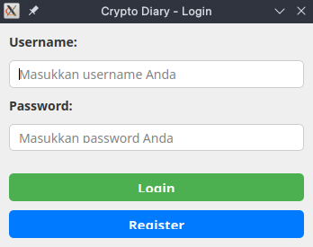
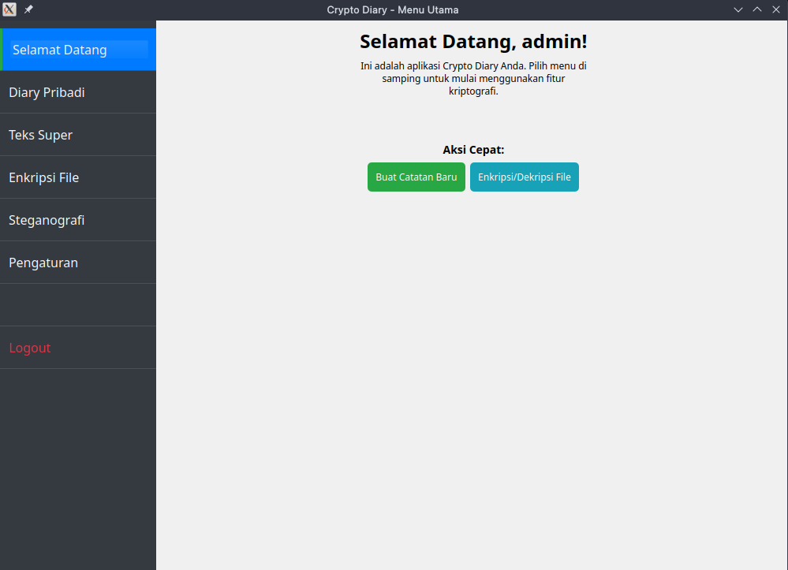

# 🔐 CryptoDiary — Secure Digital Journal


**CryptoDiary** adalah aplikasi **desktop digital diary** dengan fokus utama pada **keamanan dan privasi data pengguna**.

Berbeda dari aplikasi catatan biasa, CryptoDiary menerapkan **End-to-End Database Encryption** menggunakan algoritma kriptografi tingkat militer **AES-256 GCM**, serta fitur **Steganografi** untuk menyembunyikan pesan rahasia di dalam file gambar.

> **Security Highlight**
> Seluruh data diary disimpan dalam bentuk **Encrypted Binary (BLOB)**. Jika database dicuri, isinya hanya akan terbaca sebagai data biner acak yang tidak bermakna.

---

## 🌟 Key Features

### 🛡️ Military-Grade Cryptography

* **AES-256 GCM**
  Mengenkripsi judul dan isi diary dengan jaminan *confidentiality* dan *integrity* melalui authentication tag
* **PBKDF2 Password Hashing**
  Password diproses menggunakan **100.000 iterasi SHA-256** dengan *unique salt* per user untuk mencegah serangan *brute force* dan *rainbow table*

### 🖼️ Hybrid Steganography System

* **LSB (Least Significant Bit)**
  Menyisipkan pesan rahasia ke dalam piksel gambar (PNG)
* **Pre-Encryption Layer**
  Pesan dienkripsi terlebih dahulu sebelum proses steganografi untuk meningkatkan resistansi terhadap *steganalysis*

### 💾 Secure Local Storage

* **SQLite BLOB Storage**
  Seluruh data teks dikonversi menjadi *raw bytes* sebelum disimpan
* **Anti-Tamper Protection**
  Proses dekripsi otomatis dibatalkan jika authentication tag tidak valid (indikasi manipulasi data)

---

## 📸 User Interface Preview

| Login Screen               | Menu View                      |
| -------------------------- | ------------------------------ |
|  |  |

---

## 🚀 Installation & Usage

### 1️⃣ Clone Repository

```bash
git clone https://github.com/starbaudelaire/CryptoDiary-App.git
cd CryptoDiary-App
```

### 2️⃣ Install Dependencies

Pastikan **Python 3.x** sudah terpasang.

```bash
pip install -r requirements.txt
```

### 3️⃣ Run Application

```bash
python main.py
```

---

## 🛠️ Tech Stack

* **Core Language**: Python 3.12
* **GUI Framework**: PyQt5 (Qt Designer)
* **Cryptography**: pycryptodomex (AES, Blowfish), hashlib
* **Image Processing**: Pillow (PIL)
* **Database**: SQLite3

---

## 👨‍💻 Credits

Project ini dibuat sebagai **Tugas Akhir Mata Kuliah Kriptografi**.

* **Authors**:

  * Muhammad Bintang Alkautsar (@starbaudelaire)
  * Muhammad Dira Raharja
* **Institution**: UPN "Veteran" Yogyakarta

---

🔒 CryptoDiary cocok untuk eksperimen **applied cryptography**, **secure storage**, dan **steganography implementation**.
Kalau mau dikembangin: password vault, key rotation, atau secure export—tinggal gas 🚀
